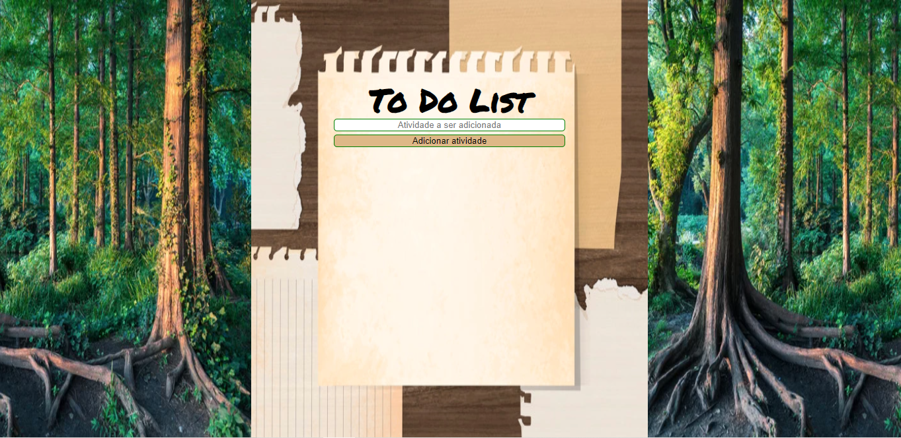

# Projeto-Avaliativo-1---To-Do-List
# Nome do projeto

> Este é o primeiro projeto do curso DEV IN HOUSE. A tarefa consiste em criar uma página com lista de tarefas, e fornecer os arquivos .html, .css e .js que compõem a página.

